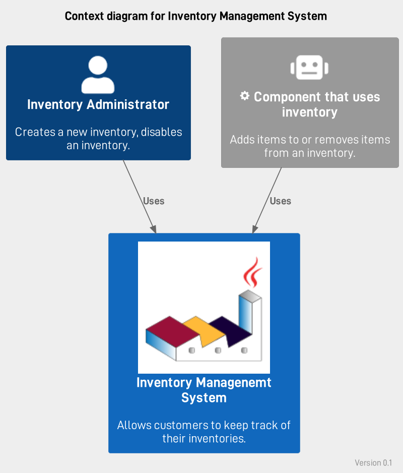
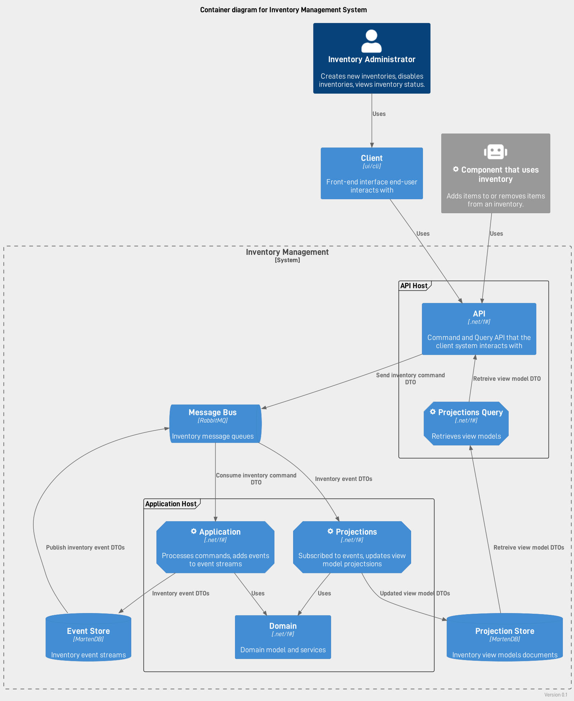
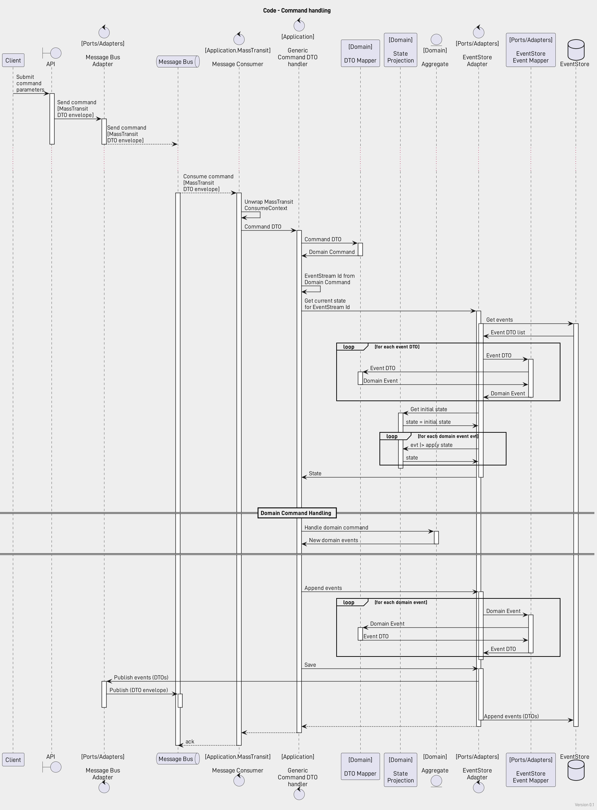

# Architecture

## Overview

[Functional Core, Imperative Shell](./functional-core-imperative-shell.md)

## Context

## Containers

## Components

[Dependencies](./dependencies.md)

## Code

### Command Handling

